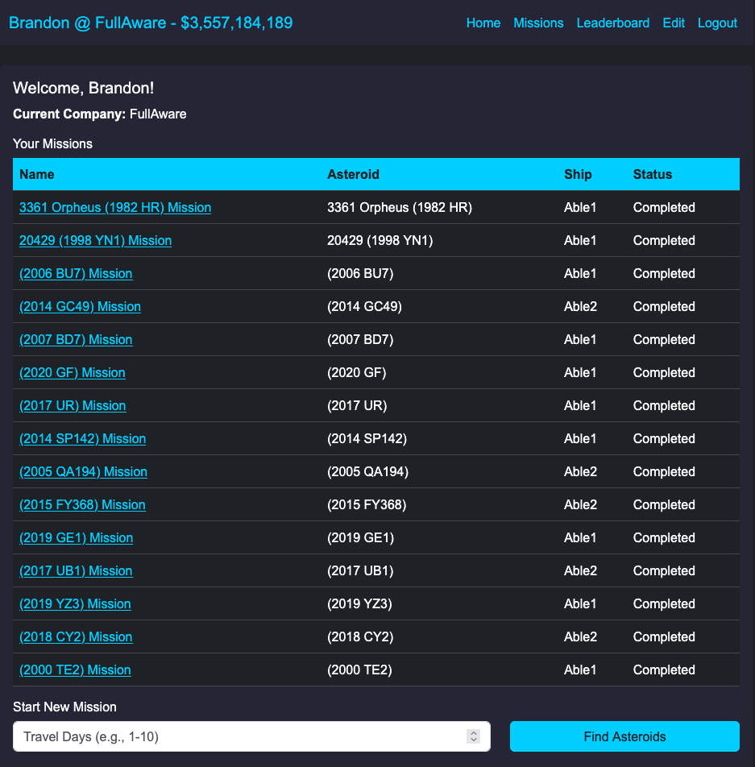
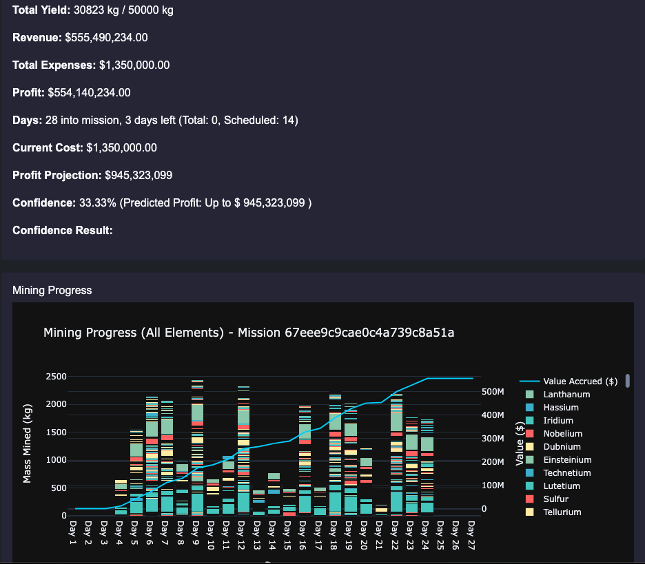

# AstroSurge

## Overview

**AstroSurge** is a simulation designed to manage asteroid mining operations, resource extraction, and economic decision-making. The project allows users to plan missions, mine asteroids, manage ships, and sell their valuable resources. It combines elements of resource management, logistics, and strategy to create a dynamic and engaging experience.

### Missions


### Mining Details


## Purpose

The primary goal of the AstroSurge is to simulate the complexities of asteroid mining and resource management in a futuristic setting. It aims to:
- **Explore the potential of asteroid mining** as a sustainable source of rare and valuable materials.
- **Simulate economic and logistical challenges** involved in space exploration and resource extraction.
- **Provide a framework for decision-making** in resource allocation, mission planning, and ship management.

## Key Features

1. **Asteroid Mining:**
   - Locate and assess the value of asteroids based on their composition and proximity to Earth.
   - Mine valuable elements like gold, platinum, and rare earth metals.
   - Manage mined resources and update asteroid data dynamically.

2. **Ship Management:**
   - Build and manage a fleet of mining ships with customizable attributes like capacity, mining power, and hull integrity.
   - Track ship locations, missions, and cargo.
   - Repair and maintain ships to ensure operational efficiency.

3. **Mission Planning:**
   - Plan and execute mining missions to maximize resource extraction and minimize costs.
   - Track mission progress, including projected and actual costs, durations, and outcomes.
   - Handle unexpected challenges like ship damage or resource depletion.

4. **Resource Trading and Distribution:**
   - Sell mined resources to generate revenue.
   - Distribute resources for industrial, medical, and other uses.
   - Update user accounts with the value of mined resources and manage economic growth.


## Setup

1. Clone the repository:
   ```sh
   git clone https://github.com/fullaware/astrosurge.git
   cd astrosurge
   ```

2. Install dependencies:
   ```sh
   python3.13 -m venv venv && source venv/bin/activate && pip install --upgrade pip && pip install -r requirements.txt
   ```

3. Run the application:
   ```sh
   uvicorn app:app --host 0.0.0.0 --port 8080 --reload
   ```

## Contributing

Contributions are welcome! Please submit a pull request or open an issue to suggest improvements.

## License

This project is licensed under the MIT License. See the `LICENSE` file for details.

Ethical AI use provided via feedback score and comment. [3 Laws of Kindness](https://www.fullaware.com/posts/aigoldenrule/)


