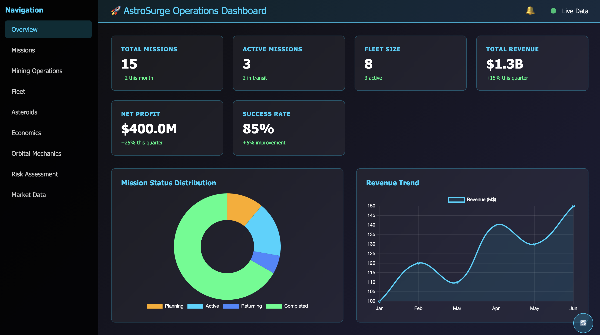

# AstroSurge

## Overview

**AstroSurge** is a simulation designed to manage asteroid mining operations, resource extraction, and economic decision-making. The project allows users to plan missions, mine asteroids, manage ships, and sell their valuable resources. It combines elements of resource management, logistics, and strategy to create a dynamic and engaging experience.

## Current Status ✅ **November 2025**



AstroSurge now features a **complete FastAPI backend** with MongoDB integration and a **comprehensive Web Dashboard** for mission planning and fleet management. The system supports mission planning wizards, asteroid selection, ship management, financing, and real-time mission tracking.

### 🚀 **New Features**
- **FastAPI Backend**: Complete REST API with MongoDB integration (`api.py`)
- **Flask Web Dashboard**: Comprehensive web interface (`webapp.py`) with real-time updates
- **Mission Planning Wizard**: Step-by-step mission creation with asteroid-first selection
- **Asteroid Analysis**: Detailed asteroid information including estimated value, travel time, and mining potential
- **Ship Management**: Purchase ships from catalog or reuse existing fleet
- **Financing System**: Auto-calculated mission financing with loan management
- **Docker Compose Deployment**: Containerized services with health checks
- **Real-time Updates**: Live mission status and cargo tracking

## Quick Start

### Docker Compose Launch (Recommended)

The easiest way to start AstroSurge is using Docker Compose:

```bash
docker-compose up -d
```

This will start both:
- **FastAPI Backend** on `http://localhost:8000` (API endpoints and documentation)
- **Flask Web Dashboard** on `http://localhost:5000` (Dashboard and visualization)

### Environment Variables

Create a `.env` file in the project root (copy from `env.example`):

```bash
MONGODB_URI=mongodb://your-mongodb-uri/asteroids
API_HOST=api
API_PORT=8000
WEB_PORT=5000
```

**Note**: In Docker Compose, `API_HOST` should be `api` (service name). For local development, use `localhost`.

### Manual Service Launch

If you prefer to run services separately (without Docker):

**Backend API:**
```bash
uvicorn api:app --host 0.0.0.0 --port 8000
```

**Frontend Dashboard:**
```bash
python3 webapp.py
```

## Purpose

The primary goal of the AstroSurge is to simulate the complexities of asteroid mining and resource management in a futuristic setting. It aims to:
- **Explore the potential of asteroid mining** as a sustainable source of rare and valuable materials.
- **Simulate economic and logistical challenges** involved in space exploration and resource extraction.
- **Provide a framework for decision-making** in resource allocation, mission planning, and ship management.

## Key Features

1. **Asteroid Mining:**
   - Locate and assess the value of asteroids based on their composition and proximity to Earth.
   - Mine valuable elements like gold, platinum, and rare earth metals.
   - Manage mined resources and update asteroid data dynamically.

2. **Ship Management:**
   - Build and manage a fleet of mining ships with customizable attributes like capacity, mining power, and hull integrity.
   - Track ship locations, missions, and cargo.
   - Repair and maintain ships to ensure operational efficiency.

3. **Mission Planning:**
   - Plan and execute mining missions to maximize resource extraction and minimize costs.
   - Track mission progress, including projected and actual costs, durations, and outcomes.
   - Handle unexpected challenges like ship damage or resource depletion.

4. **Resource Trading and Distribution:**
   - Sell mined resources to generate revenue.
   - Distribute resources for industrial, medical, and other uses.
   - Update user accounts with the value of mined resources and manage economic growth.

5. **Fleet Control Center:**
   - **Comprehensive fleet overview** with all ships and their current status
   - **Real-time location tracking** showing ships on Earth, in space, or at asteroids
   - **Mission monitoring** with progress updates and estimated completion times
   - **Estimated payoff calculations** for active missions based on cargo and costs
   - **Ship selection and detailed inspection** for operational management

## Architecture

### Backend (FastAPI)
- **API Server**: Running on http://localhost:8000 (`api.py`)
- **Database**: MongoDB with 958K+ asteroid records
- **Endpoints**: Complete REST API for ships, missions, asteroids, financing, and fleet management
- **Services**: Orbital mechanics, commodity pricing, mining operations, mission economics

### Frontend (Flask)
- **Web Dashboard**: Running on http://localhost:5000 (`webapp.py`)
- **Features**: Mission planning wizard, real-time mission tracking, cargo management, fleet overview
- **UI Components**: Asteroid selection, ship catalog, financing calculator, mission progress viewer

## Setup

### Prerequisites
- Python 3.13+
- MongoDB running locally or accessible via connection string
- Docker and Docker Compose (for containerized deployment)

### 1. Clone the repository:
```sh
git clone https://github.com/fullaware/astrosurge.git
cd astrosurge
```

### 2. Install Python dependencies:
```sh
python3.13 -m venv venv && source venv/bin/activate && pip install --upgrade pip && pip install -r requirements.txt
```

### 3. Configure environment:
```sh
cp env.example .env
# Edit .env with your MongoDB URI
```

### 4. Start the FastAPI backend:
```sh
uvicorn api:app --host 0.0.0.0 --port 8000 --reload
```

### 5. Start the Flask frontend (in a new terminal):
```sh
python3 webapp.py
```

### 6. Access the application:
- **Web Dashboard**: http://localhost:5000
- **API**: http://localhost:8000
- **API Documentation**: http://localhost:8000/docs

## Docker Compose Deployment

For containerized deployment, use Docker Compose:

### 1. Configure environment:
```sh
cp env.example .env
# Edit .env with your MongoDB URI
```

### 2. Deploy with Docker Compose:
```sh
# Start both services (API and WebApp)
docker-compose up -d

# View logs
docker-compose logs -f

# Stop services
docker-compose down
```

### 3. Access services:
- **API Backend**: http://localhost:8000
  - API Docs: http://localhost:8000/docs
  - Health Check: http://localhost:8000/health
- **Web Dashboard**: http://localhost:5000
  - Dashboard: http://localhost:5000/

### 4. Build individual services:
```sh
# Build API only
docker-compose build api

# Build WebApp only
docker-compose build webapp

# Rebuild without cache
docker-compose build --no-cache
```

### 4. Service management:
```sh
# View logs
docker-compose logs -f

# Stop services
docker-compose down

# Check status
docker-compose ps
```

## Testing

### Running Tests

The project includes comprehensive test coverage:

```sh
# Run all tests with coverage
./run_tests.sh

# Run only unit tests
./run_tests.sh --unit-only

# Run without performance tests
./run_tests.sh --no-performance

# Run specific test file
pytest tests/test_api_endpoints.py -v

# Run with coverage report
pytest tests/ --cov=src --cov=api --cov-report=html
```

### Test Coverage

The test suite includes:
- ✅ **Unit Tests**: All business logic services (13 test files)
- ✅ **API Endpoint Tests**: Complete FastAPI endpoint coverage
- ✅ **Integration Tests**: End-to-end workflow testing
- ✅ **Performance Tests**: Response time and load testing

### Test Structure

```
tests/
├── test_api_endpoints.py      # API endpoint tests
├── test_integration.py        # Integration tests
├── test_performance.py        # Performance tests
├── test_commodity_pricing*.py # Pricing service tests
├── test_mission_economics*.py # Economics service tests
├── test_orbital_mechanics.py  # Orbital mechanics tests
├── test_mining_operations.py  # Mining operations tests
└── ...                        # Other service tests
```

## API Endpoints

### Core Endpoints
- `GET /health` - Health check
- `GET /api/asteroids` - List asteroids with filtering
- `GET /api/asteroids/{asteroid_id}/details` - Get detailed asteroid information
- `GET /api/ships` - Get user's ships
- `GET /api/ships/catalog` - Get available ship models
- `POST /api/ships/purchase` - Purchase new ship
- `GET /api/missions` - Get user's missions
- `GET /api/missions/{mission_id}/results` - Get detailed mission results
- `POST /api/missions` - Create new mission
- `GET /api/missions/budget-estimate` - Calculate mission budget
- `GET /api/financing/calculate` - Auto-calculate financing needs
- `POST /api/financing/loans` - Create loan

### Mission Management
- **Mission Planning Wizard**: Step-by-step mission creation with asteroid-first approach
- **Asteroid Analysis**: Detailed information including estimated value and mining potential
- **Ship Catalog**: Predefined ship models with specifications
- **Auto Financing**: Automatic calculation of financing needs based on mission costs
- **Real-time Tracking**: Live mission status, cargo accumulation, and phase transitions

## Mission Planning Wizard

The mission planning wizard provides a **step-by-step process** for creating new missions:

- **🌌 Step 1: Asteroid Selection**: Choose target asteroid with detailed analysis (estimated value, travel time, mining potential)
- **📋 Step 2: Mission Info**: Enter mission name and description
- **🚀 Step 3: Ship Selection**: Choose existing ship or purchase from catalog
- **💰 Step 4: Financing**: Auto-calculated financing needs with loan management
- **📊 Step 5: Budget Review**: Detailed cost breakdown and ROI estimates
- **✅ Step 6: Launch Readiness**: Final checks before mission creation

## Dashboard Features

The web dashboard provides a **comprehensive operations overview**:

- **📊 Overview Metrics**: Total missions, active missions, fleet size, revenue, profit, success rate
- **📈 Data Visualizations**: Mission status distribution, revenue trends
- **🚀 Mission Management**: Create, launch, pause, resume, and track missions
- **⛏️ Mining Operations**: Real-time cargo accumulation and mining efficiency
- **🛸 Fleet Management**: Ship status, capacity, and operational readiness
- **💎 Asteroid Database**: Browse and analyze asteroids with detailed information

## Database Schema

The system uses a **validated MongoDB schema** with:

- **958K+ asteroid records** with SPK-ID, NEO classification, and element composition
- **119 chemical elements** with properties and asteroid class distributions
- **Comprehensive mission tracking** with 41 fields for detailed analysis
- **Ship management** with status, location, and cargo tracking
- **User and company management** for multi-user support

## Contributing

Contributions are welcome! Please submit a pull request or open an issue to suggest improvements.

## License

This project is licensed under the MIT License. See the `LICENSE` file for details.

Ethical AI use provided via feedback score and comment. [3 Laws of Kindness](https://www.fullaware.com/posts/aigoldenrule/)


