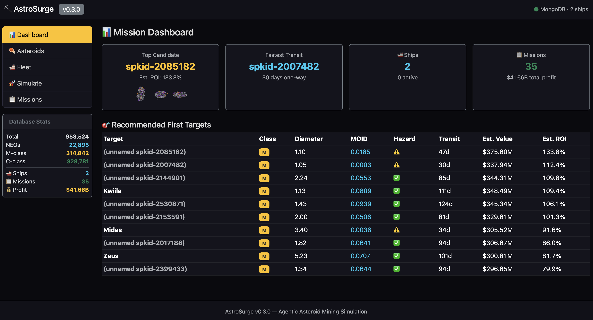

# AstroSurge — Agentic Asteroid Mining Simulator

[](https://github.com/fullaware/astrosurge)
[](LICENSE)

AstroSurge is an agentic asteroid mining simulation system with a stateful mission engine, persistent MongoDB backend, and a mobile-responsive dark-theme web UI.

## Overview

AstroSurge models the complete lifecycle of asteroid mining operations:

```
Build Ship → Launch Mission → Mine Asteroid → Sell Cargo → Upgrade Ship → Repeat
```

Missions progress through 11 phases (identification → transit → setup → mining → prep → return → sale → analysis), each generating financial snapshots and events.

### Key Features

- **Stateful Mission Engine**: Full mission progression with 11 phases
- **Persistent MongoDB Backend**: Ships, missions, events, and market data
- **Tiered Mission System**: 4 tiers unlock through ship upgrades
- **Day-by-Day Tick Timeline**: Detailed mission progress visualization
- **Mobile-Responsive UI**: Dark theme with Bootstrap 5

### Screenshots



*AstroSurge Dashboard showing asteroid candidates, fleet overview, and mission statistics*

### Mission Tiers

| Tier | Mission Type | Target | Requirement | Est. ROI |
|------|-------------|--------|-------------|----------|
| 1 | Fast ROI (PGM Strike) | M-class | Base mining ship | 5-8x |
| 2 | Ice Farming | C-class | Water extraction + tankage | 3-5x |
| 3 | Hazard Hunter | PHA | Propulsion manufacturing bay | 1-3x |
| 4 | Precision Extraction | M-class (high-grade) | Advanced ore refinement + swarm AI | 10-20x |

## Architecture

### Repository Structure

```
astrosurge/
├── src/astrosurge/         # Python application code
│   ├── __init__.py
│   ├── config.py           # Configuration and settings
│   ├── db.py               # MongoDB CRUD operations
│   ├── engine.py           # Mission orchestrator
│   ├── events.py           # Phase-specific event generators
│   ├── finance.py          # Funding pool tracking
│   ├── market.py           # Market state and pricing
│   ├── mining.py           # Mining operations
│   ├── mission.py          # Full mission runner
│   ├── models.py           # Data models
│   ├── transit.py          # Transit time calculation
│   ├── asteroid_filter.py  # Target selection
│   ├── composition.py      # Asteroid composition
│   ├── imagegen.py         # SVG image generation
│   └── web/                # FastAPI web server
├── webui/                  # Frontend web UI
│   ├── templates/          # HTML templates
│   └── static/             # CSS, JavaScript, images
├── tests/                  # Unit tests
├── scripts/                # Utility scripts
├── docker-compose.yml      # Docker deployment
├── Dockerfile              # Container build
├── pyproject.toml          # Python dependencies
├── PRD.md                  # Product Requirements
├── HANDOFF.md              # Handoff documentation
└── README.md               # This file
```

### Technology Stack

- **Backend**: Python 3.12 with FastAPI
- **Database**: MongoDB (Community Edition)
- **Frontend**: Bootstrap 5, vanilla JavaScript
- **Container**: Docker with uvicorn
- **Orchestration**: Docker Compose

## Quick Start

### Prerequisites

- Docker and Docker Compose
- MongoDB server (local or remote)
- MongoDB URI with read/write access

### Deployment

```bash
# Clone the repository
git clone https://github.com/fullaware/astrosurge.git
cd astrosurge

# Copy environment template and configure
cp .env.example .env
# Edit .env with your MongoDB URI

# Start the application
docker-compose up -d

# View logs
docker-compose logs -f astrosurge
```

### Environment Variables

| Variable | Description | Default |
|----------|-------------|---------|
| `MONGODB_URI` | MongoDB connection string | `mongodb://localhost:27017/` |
| `MONGODB_DATABASE` | Database name | `astrosurge` |

## Web Interface

The application is accessible at `http://localhost:8001`.

### Dashboard

- Top candidates with Fast ROI analysis
- Fastest transit targets
- Fleet overview
- Mission statistics

### Asteroids View

- Browse asteroid candidates
- Filter by MOID (Minimum Orbit Intersection Distance)
- View detailed asteroid information
- Check mission history for surveyed asteroids

### Fleet View

- Build new ships
- View ship status and upgrades
- Launch new missions
- Manage active ships

### Simulate View

- Test mission parameters
- View projected ROI
- Analyze mission phases

### Missions View

- Complete mission history
- Day-by-day tick timeline
- Event logs
- Performance metrics

## API Documentation

The FastAPI server provides comprehensive API endpoints:

- `GET /api/health` - Health check
- `GET /api/asteroids/candidates` - Find asteroid candidates
- `GET /api/asteroids/{spkid}` - Asteroid details
- `GET /api/asteroids/{spkid}/image` - Asteroid SVG image
- `GET /api/missions` - List all missions
- `GET /api/missions/{mission_id}` - Mission details
- `POST /api/fleet/ships` - Build a ship
- `POST /api/missions` - Launch a mission
- `GET /api/market` - Current market prices

## Development

### Running Locally

```bash
# Install dependencies
pip install -e .

# Run the application
uvicorn astrosurge.web.app:app --reload --port 8000
```

### Running Tests

```bash
pytest tests/
```

### Building the Docker Image

```bash
docker-compose build
```

## Configuration

### Database Indexes

The application automatically creates indexes on startup. To manually rebuild:

```bash
python -m astrosurge.scripts.create_indexes
```


## Known Issues

- Mission detail view requires proper network configuration between containers

## Next Steps

- Refine game loop balance
- Add more mission event types
- Implement ship upgrade mechanics
- Add RAG-based asteroid classification
- Integrate with Pensive agentic memory system

## License

MIT License - see [LICENSE](LICENSE) for details.

## Author

FullAware - Homelab Infrastructure Team

## References

- [Product Requirements](PRD.md)
- [Handoff Documentation](HANDOFF.md)
- [MongoDB Documentation](https://www.mongodb.com/docs/)
- [FastAPI Documentation](https://fastapi.tiangolo.com/)
